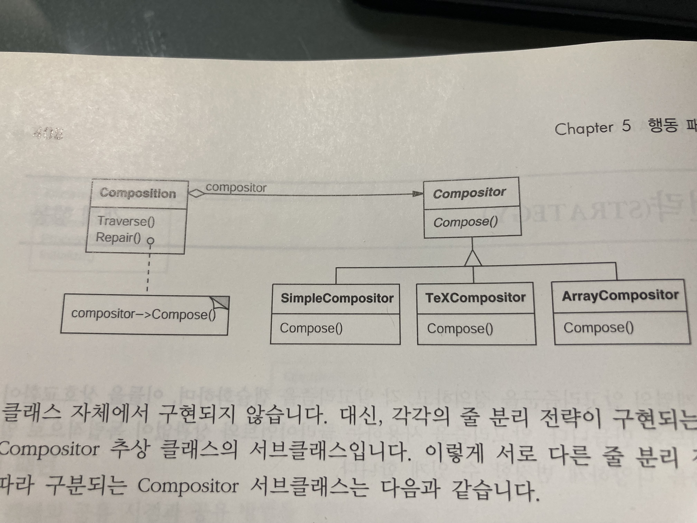

# Design Patterns
### Strategy
  의도)
   - 동일 계열의 알고리즘군을 정의하고, 각 알고리즘을 캡슐화하며, 이들을 상호교환이 가능하도록 만듬. 
     알고리즘을 사용하는 클라이언트와 상과없이 독립적으로 알고리즘을 다양하게 변경할 수 있게 함.
     
  구조)
   - 
  
  장점)
   - 불필요한 중복 코드 제거
   - 어떤 행위를 실행하는 부분을 추가로 신경쓰지 않아도됨(서비스 추가 구현을 제외한 이외 로직에 대한 고민)
   - 
  단점)
   - 직관적이지 않음?
   - 추가 계산로직 필요
   
  주관적인 생각)
   -  동일한 행위를 다양하게 선택해서 사용 방법. 
      동일한 행위 => 인터페이스에 정의함 => 각각의 구현 클래스에선 어떨때 선택될 수 있는지를 추가로 작성해 동적으로 선택해서 사용할 수 있게 함 