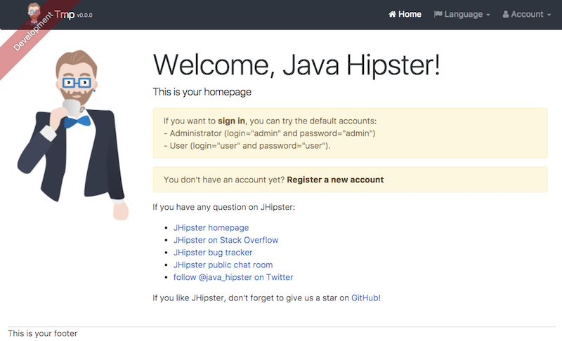
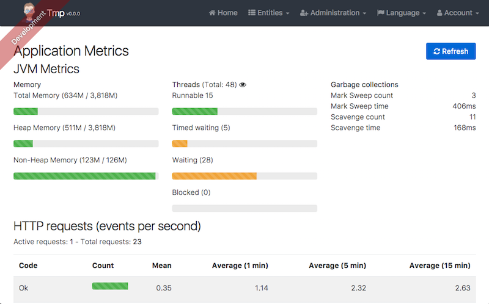
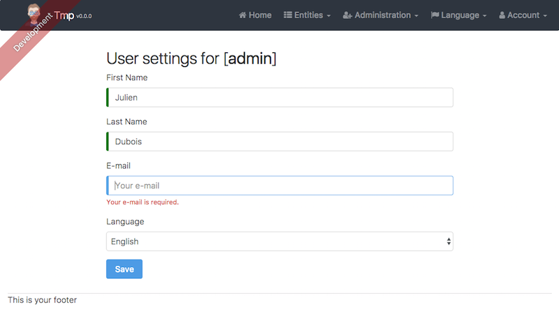
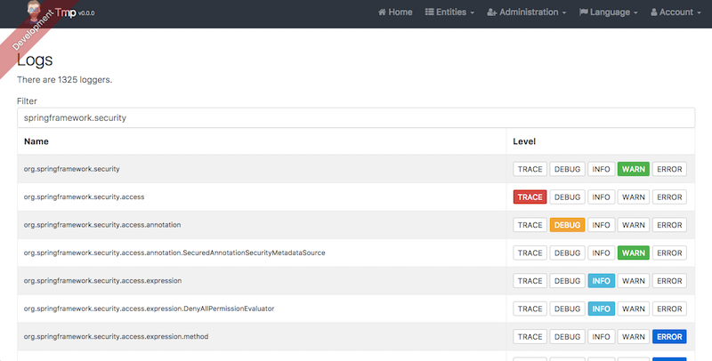
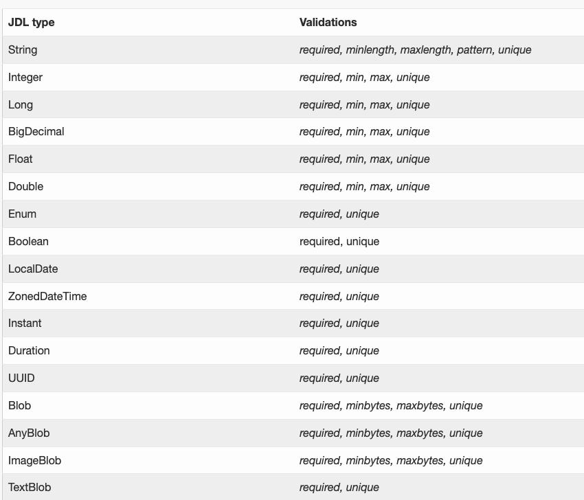
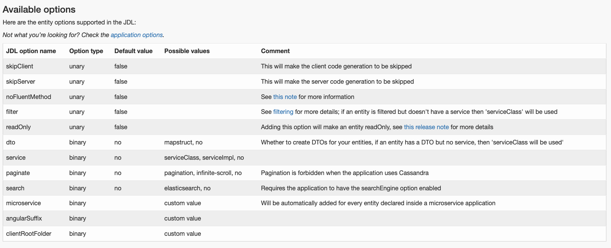
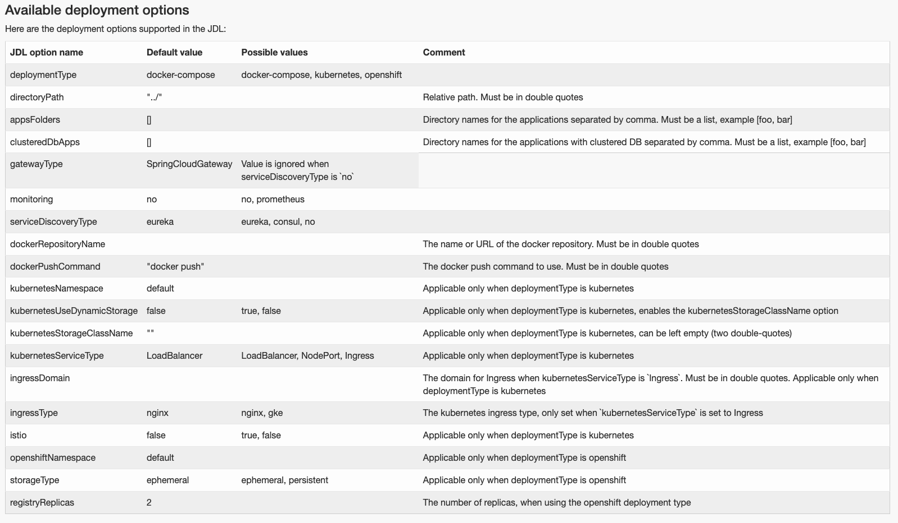

# JHipster
Java 기반의 개발(웹)을 빠르게 할 수 있도록 도와주는 플랫폼(Spring Framework 보다 상위 단계의 개발 플랫폼)
-- 
 
## Java 기반의 웹 개발
 - front-end 
    - framework : Angular, React, Vue
    - development workflow
        - 신규 자바 스크립트 라이브러리는 npm을 통해 설치
        - 웹팩으로 build 및 optimization과 live reload
        - Jest와 Protractor 로 test
 - back-end
    - framework : spring, spring security, spring mvc, spring webflux, spring data jpa
    - build : maven or gradle(Jar or WAR)
    - microservices architecture sepc : spring cloud gateway, netflix oss(Eureka, Hystrix...)
    - etc : elastic search, mongoDB, Couchbase, Cassandra, Kafka, Cache(EhCache, Caffeine, Redis...), Supporting full
     Docker or Docker Compose, Supporting cloud services(AWS, GCP, Cloud Foundry, Heroku, Azure...)
     
     
## JHipster 에서 제공하는 화면
- 메인 페이지

- 모니터링 화면

- 데이터 추가 폼

- 서버 로그 설정 관리 화면

    

## 많은 기업에서 사용중)

 
 
## 사용하는 방법)
 0. 준비: JAVA 설치, Git 설치, Node.js 설치
 1. JHister 설치 
    - npm install -g generator-jhipster
 2. 폴더 생성 및 이동
    - mkdir sample && cd smaple
 3. jhipster 명령어 실행 및 설정
 4. JDL(JHipster Domain Language) 생성
    - https://start.jhipster.tech/jdl-studio
 5. jdl 실행
    - jhipster jdl <jdl file>
    
## 추가 기능
 - 도메인 추가
 - 컨트롤러 추가(jhipster spring-controller <controller name>)
 - 서비스 추가(jhipster spring-service <service name>)
  - jhipster 에서는 엔티티를 만들때 기본적으로 crud 관련 서비스 클래스를 만들지 않는데 이유는 Repository로 대신할 수 있기 때문
  - 서비스 로직은 여러 Repository가 사용되기 때문에 자동으로 만들 수 없는 영역


## JDL
 - JDL-Studio 나 JHipster IDE 를 통해서 도메인간의 관계를 정의하는 언어. 엔티티 생성 뿐만 아니라 관련 기본 클래스도 생성(컨트롤러, 레퍼지토리)

 - field types (https://www.jhipster.tech/jdl/entities-fields#field-types-and-validations)
  ```
  Entity <entity name>(<table name>) {
    <field name> <field type>
  
  } 
  
  ```
 


 - relationships
    - OneToOne
    - OneToMany
    - ManyToOne
    - ManyToMany
 ```
relationship (OneToMany | ManyToOne | OneToOne | ManyToMany) {
  <from entity>[{<relationship name>[(<display field>)]}] to <to entity>[{<relationship name>[(<display field>)]}]+
}
 
 ```
 
 - Options
 
 - Deployments

 


참고) [https://www.jhipster.tech](https://www.jhipster.tech).

## Project Structure

Node is required for generation and recommended for development. `package.json` is always generated for a better development experience with prettier, commit hooks, scripts and so on.

In the project root, JHipster generates configuration files for tools like git, prettier, eslint, husk, and others that are well known and you can find references in the web.

`/src/*` structure follows default Java structure.

- `.yo-rc.json` - Yeoman configuration file
  JHipster configuration is stored in this file at `generator-jhipster` key. You may find `generator-jhipster-*` for specific blueprints configuration.
- `.yo-resolve` (optional) - Yeoman conflict resolver
  Allows to use a specific action when conflicts are found skipping prompts for files that matches a pattern. Each line should match `[pattern] [action]` with pattern been a [Minimatch](https://github.com/isaacs/minimatch#minimatch) pattern and action been one of skip (default if ommited) or force. Lines starting with `#` are considered comments and are ignored.
- `.jhipster/*.json` - JHipster entity configuration files

- `npmw` - wrapper to use locally installed npm.
  JHipster installs Node and npm locally using the build tool by default. This wrapper makes sure npm is installed locally and uses it avoiding some differences different versions can cause. By using `./npmw` instead of the traditional `npm` you can configure a Node-less environment to develop or test your application.
- `/src/main/docker` - Docker configurations for the application and services that the application depends on

## Development

Before you can build this project, you must install and configure the following dependencies on your machine:

1. [Node.js][]: We use Node to run a development web server and build the project.
   Depending on your system, you can install Node either from source or as a pre-packaged bundle.

After installing Node, you should be able to run the following command to install development tools.
You will only need to run this command when dependencies change in [package.json](package.json).

```
npm install
```

We use npm scripts and [Webpack][] as our build system.

Run the following commands in two separate terminals to create a blissful development experience where your browser
auto-refreshes when files change on your hard drive.

```
./mvnw
npm start
```

Npm is also used to manage CSS and JavaScript dependencies used in this application. You can upgrade dependencies by
specifying a newer version in [package.json](package.json). You can also run `npm update` and `npm install` to manage dependencies.
Add the `help` flag on any command to see how you can use it. For example, `npm help update`.

The `npm run` command will list all of the scripts available to run for this project.

### PWA Support

JHipster ships with PWA (Progressive Web App) support, and it's turned off by default. One of the main components of a PWA is a service worker.

The service worker initialization code is commented out by default. To enable it, uncomment the following code in `src/main/webapp/index.html`:

```html
<script>
  if ('serviceWorker' in navigator) {
    navigator.serviceWorker.register('./service-worker.js').then(function () {
      console.log('Service Worker Registered');
    });
  }
</script>
```

Note: [Workbox](https://developers.google.com/web/tools/workbox/) powers JHipster's service worker. It dynamically generates the `service-worker.js` file.

### Managing dependencies

For example, to add [Leaflet][] library as a runtime dependency of your application, you would run following command:

```
npm install --save --save-exact leaflet
```

To benefit from TypeScript type definitions from [DefinitelyTyped][] repository in development, you would run following command:

```
npm install --save-dev --save-exact @types/leaflet
```

Then you would import the JS and CSS files specified in library's installation instructions so that [Webpack][] knows about them:
Note: There are still a few other things remaining to do for Leaflet that we won't detail here.

For further instructions on how to develop with JHipster, have a look at [Using JHipster in development][].

### JHipster Control Center

JHipster Control Center can help you manage and control your application(s). You can start a local control center server (accessible on http://localhost:7419) with:

```
docker-compose -f src/main/docker/jhipster-control-center.yml up
```

## Building for production

### Packaging as jar

To build the final jar and optimize the shop application for production, run:

```
./mvnw -Pprod clean verify
```

This will concatenate and minify the client CSS and JavaScript files. It will also modify `index.html` so it references these new files.
To ensure everything worked, run:

```
java -jar target/*.jar
```

Then navigate to [http://localhost:8080](http://localhost:8080) in your browser.

Refer to [Using JHipster in production][] for more details.

### Packaging as war

To package your application as a war in order to deploy it to an application server, run:

```
./mvnw -Pprod,war clean verify
```

## Testing

To launch your application's tests, run:

```
./mvnw verify
```

### Client tests

Unit tests are run by [Jest][]. They're located in [src/test/javascript/](src/test/javascript/) and can be run with:

```
npm test
```

UI end-to-end tests are powered by [Cypress][]. They're located in [src/test/javascript/cypress](src/test/javascript/cypress)
and can be run by starting Spring Boot in one terminal (`./mvnw spring-boot:run`) and running the tests (`npm run e2e`) in a second one.

#### Lighthouse audits

You can execute automated [lighthouse audits][https://developers.google.com/web/tools/lighthouse/] with [cypress audits][https://github.com/mfrachet/cypress-audit] by running `npm run e2e:cypress:audits`.
You should only run the audits when your application is packaged with the production profile.
The lighthouse report is created in `target/cypress/lhreport.html`

For more information, refer to the [Running tests page][].

### Code quality

Sonar is used to analyse code quality. You can start a local Sonar server (accessible on http://localhost:9001) with:

```
docker-compose -f src/main/docker/sonar.yml up -d
```

Note: we have turned off authentication in [src/main/docker/sonar.yml](src/main/docker/sonar.yml) for out of the box experience while trying out SonarQube, for real use cases turn it back on.

You can run a Sonar analysis with using the [sonar-scanner](https://docs.sonarqube.org/display/SCAN/Analyzing+with+SonarQube+Scanner) or by using the maven plugin.

Then, run a Sonar analysis:

```
./mvnw -Pprod clean verify sonar:sonar
```

If you need to re-run the Sonar phase, please be sure to specify at least the `initialize` phase since Sonar properties are loaded from the sonar-project.properties file.

```
./mvnw initialize sonar:sonar
```

For more information, refer to the [Code quality page][].

## Using Docker to simplify development (optional)

You can use Docker to improve your JHipster development experience. A number of docker-compose configuration are available in the [src/main/docker](src/main/docker) folder to launch required third party services.

For example, to start a mysql database in a docker container, run:

```
docker-compose -f src/main/docker/mysql.yml up -d
```

To stop it and remove the container, run:

```
docker-compose -f src/main/docker/mysql.yml down
```

You can also fully dockerize your application and all the services that it depends on.
To achieve this, first build a docker image of your app by running:

```
./mvnw -Pprod verify jib:dockerBuild
```

Then run:

```
docker-compose -f src/main/docker/app.yml up -d
```

For more information refer to [Using Docker and Docker-Compose][], this page also contains information on the docker-compose sub-generator (`jhipster docker-compose`), which is able to generate docker configurations for one or several JHipster applications.

## Continuous Integration (optional)

To configure CI for your project, run the ci-cd sub-generator (`jhipster ci-cd`), this will let you generate configuration files for a number of Continuous Integration systems. Consult the [Setting up Continuous Integration][] page for more information.

[jhipster homepage and latest documentation]: https://www.jhipster.tech
[jhipster 7.8.1 archive]: https://www.jhipster.tech
[using jhipster in development]: https://www.jhipster.tech/development/
[service discovery and configuration with the jhipster-registry]: https://www.jhipster.tech/microservices-architecture/#jhipster-registry
[using docker and docker-compose]: https://www.jhipster.tech/docker-compose
[using jhipster in production]: https://www.jhipster.tech/production/
[running tests page]: https://www.jhipster.tech/running-tests/
[code quality page]: https://www.jhipster.tech/code-quality/
[setting up continuous integration]: https://www.jhipster.tech/setting-up-ci/
[node.js]: https://nodejs.org/
[npm]: https://www.npmjs.com/
[webpack]: https://webpack.github.io/
[browsersync]: https://www.browsersync.io/
[jest]: https://facebook.github.io/jest/
[cypress]: https://www.cypress.io/
[leaflet]: https://leafletjs.com/
[definitelytyped]: https://definitelytyped.org/
