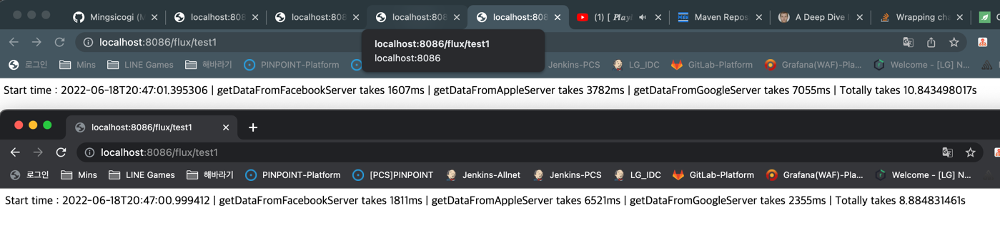

# Reactive Project
1. Publisher Type
   1. Mono (onNext x 0..1 [onError | onComplete])
   2. Flux (onNext x 0..N [onError | onComplete])
      1. 동시에 작업시간이 오래 걸리는 여러 서비를 호출했을때 결과 -> 전체 서비스 작업시간의 합보다 빠르게 작업이 완료됨.
      2. 